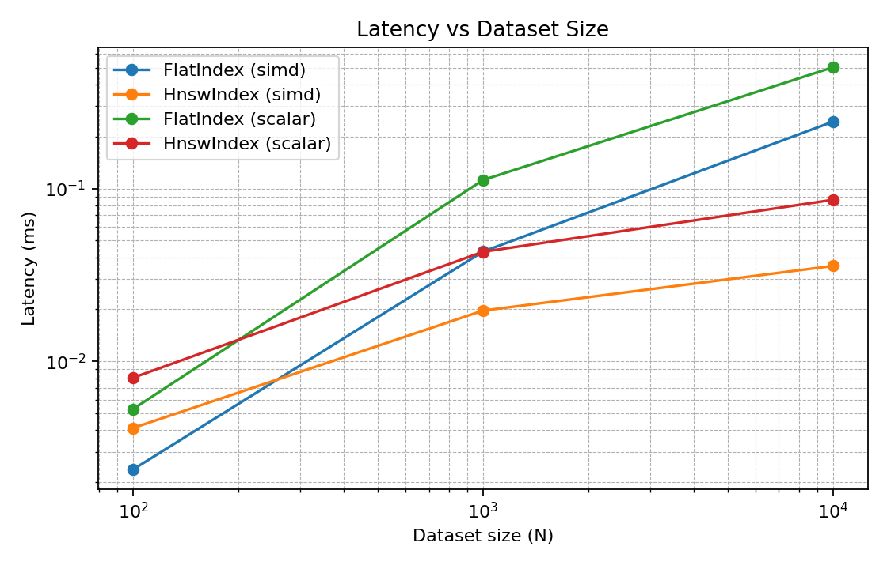
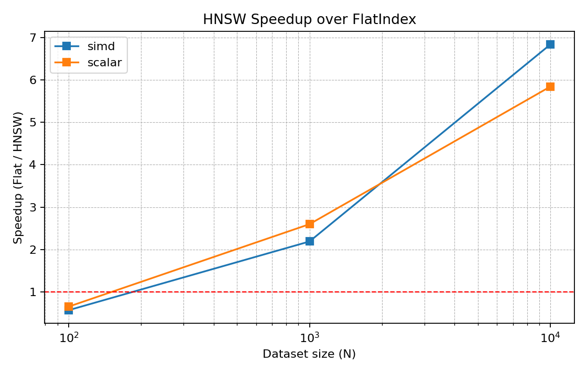
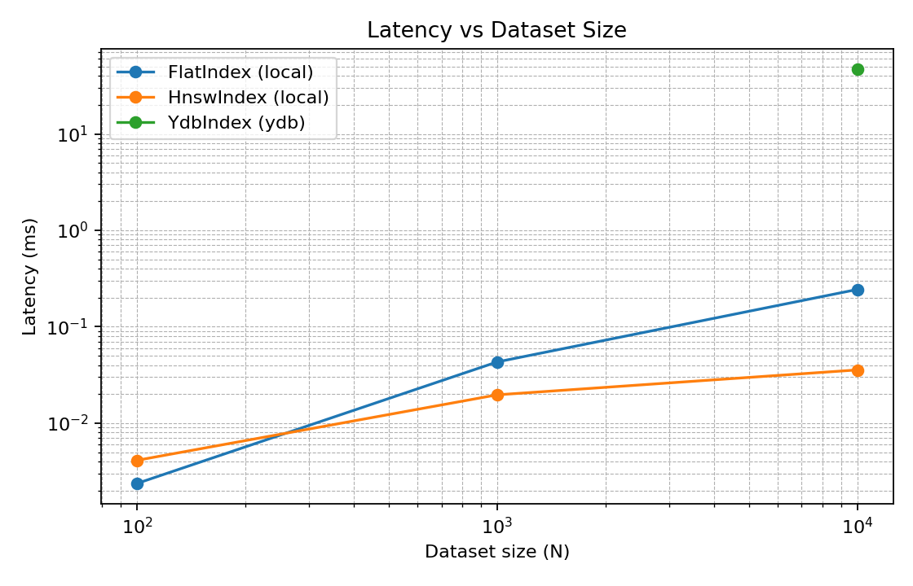
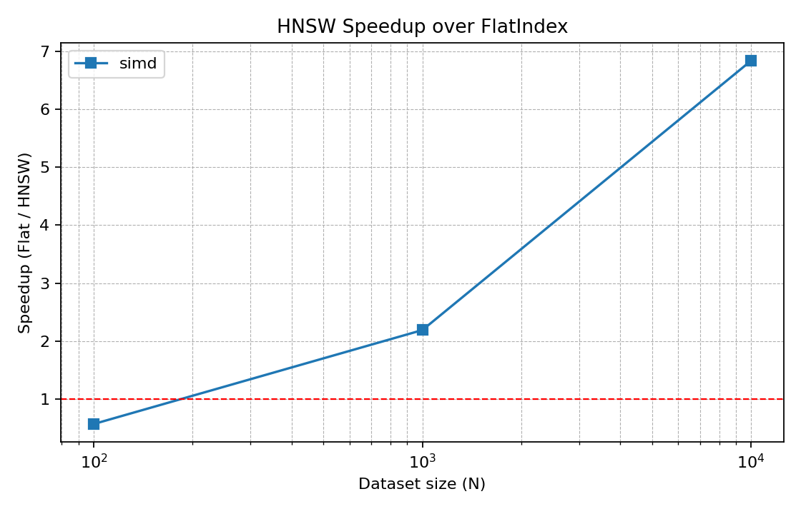

# Отчет по лабораторной работе: VectorDB (FlatIndex + HNSW + сравнение с YDB)

## 1. Цель работы

Цель - реализовать in-memory векторный поиск на C++ (FlatIndex и HNSW), измерить производительность, сравнить SIMD vs scalar путь и сопоставить локальный HNSW с ANN в YDB. Важное требование — воспроизводимые бенчмарки, графики и понятная интерпретация результата.

## 2. Реализация

### 2.1 FlatIndex

- Полный перебор по всем векторам.
- Сортировка top-k по расстоянию.
- Сложность поиска: `O(N · D)`.

### 2.2 HNSW

- Многоуровневый граф (entry point, greedy descent, поиск по слою).
- Используется `ef_search` и `ef_construction`.
- Сложность поиска: примерно `O(ef_search · log N)`.

### 2.3 Метрика и SIMD

- Метрики: `L2Squared`, `DotProduct`, `Cosine`.
- SIMD ускорение:
    - AVX-512 на x86,
    - NEON на ARM.
- Для сравнения добавлен флаг `-DVECTORDB_DISABLE_SIMD=ON`.

## 3. Методика эксперимента

Используются три сценария:

1) **SIMD vs scalar** - сравнение влияния SIMD на FlatIndex и HNSW.\
2) **FlatIndex vs HNSW (SIMD)** - сравнение алгоритмов на одном уровне оптимизации.\
3) **HNSW SIMD vs YDB ANN** - сравнение in-memory поиска с распределенной БД YDB.

### Параметры бенчмарка

- Размерность: `D = 128`.
- Top-k: `k = 10`.
- Наборы: `N = 100 / 1000 / 10000`.
- HNSW: `M=16`, `ef_construction=200`, `ef_search=50`.

## 4. Результаты (локальные бенчмарки)

### 4.1 SIMD vs scalar (мс)

| N | FlatIndex SIMD | FlatIndex scalar | Speedup | HNSW SIMD | HNSW scalar | Speedup |
|---|---:|---:|---:|---:|---:|---:|
| 100 | 0.00237 | 0.00531 | ~2.24x | 0.00412 | 0.00805 | ~1.95x |
| 1000 | 0.04318 | 0.11204 | ~2.59x | 0.01968 | 0.04307 | ~2.19x |
| 10000 | 0.24373 | 0.50269 | ~2.06x | 0.03567 | 0.08607 | ~2.41x |

**Вывод:** SIMD дает стабильное ускорение ~2x как для FlatIndex, так и для HNSW.




### 4.2 FlatIndex vs HNSW (SIMD)

| N | FlatIndex SIMD | HNSW SIMD | Speedup (Flat/HNSW) |
|---|---:|---:|---:|
| 100 | 0.00237 | 0.00412 | ~0.58x |
| 1000 | 0.04318 | 0.01968 | ~2.19x |
| 10000 | 0.24373 | 0.03567 | ~6.83x |

**Вывод:** на малых N HNSW проигрывает из-за overhead, но на больших N дает существенный выигрыш.




## 5. Сравнение с YDB ANN

YDB использует распределенную архитектуру и сетевую коммуникацию, поэтому сравнение с in-memory индексом корректно только при одинаковых параметрах (D, k, датасет) и интерпретируется как сравнение систем разных классов.

### Измерения (YDB)

- `N = 10000`, median = **46.736 ms** (из `bench_ydb.csv`).

### Сравнение с HNSW SIMD

- HNSW SIMD (N=10000): **0.0357 ms**.
- YDB ANN (N=10000): **46.7 ms**.

Отношение ~**1300x**, что объясняется сетевым overhead и транзакционным контуром YDB.

**Вывод:** для локального in-memory поиска HNSW существенно быстрее. YDB выигрывает в масштабируемости, доступности и работе с очень большими датасетами за счет распределения.


## 6. Воспроизводимость

Для воспроизведения всех трех сценариев используется один скрипт:

```bash
bash benchmarks/run_all_benchmarks.sh --install-deps --load-ydb --ydb-truncate \
  --ydb-rows 10000 \
  --table vectors \
  --index ann_index \
  --dim 128 \
  --k 10 \
  --queries 100 \
  --warmup 10 \
  --dataset-sizes 10000
```

Графики сохраняются в `output_graphs/`:
- `simd_vs_scalar/`
- `flat_vs_hnsw_simd/`
- `hnsw_vs_ydb/`

## 7. Итог

- Реализованы FlatIndex и HNSW, соблюдены требования к производительности и тестам.
- SIMD дает устойчивый прирост ~2x.
- HNSW превосходит FlatIndex на больших N.
- Сравнение с YDB корректно демонстрирует различия in-memory и распределенной БД.
